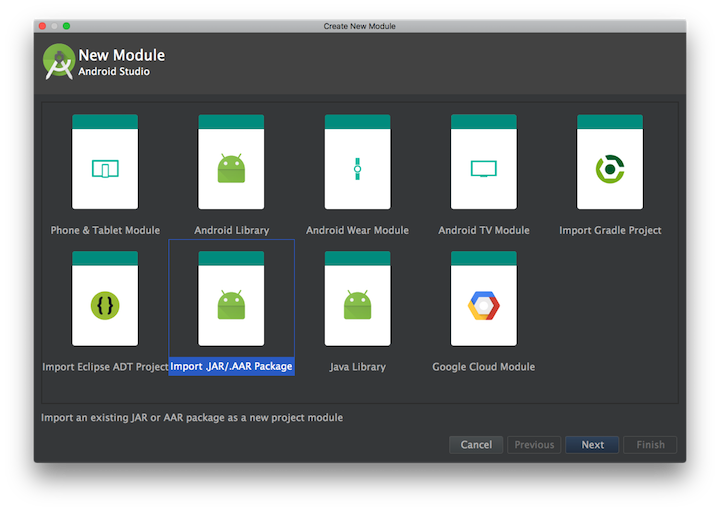
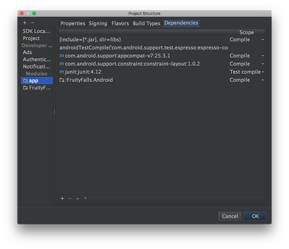

Today we are announcing the first preview release of Embeddinator-4000 for Android available on [NuGet](https://www.nuget.org/packages/Embeddinator-4000/).
```
nuget install Embeddinator-4000
```
This will place `Embeddinator-4000.exe` into the `packages/Embeddinator-4000/tools` directory.

This release supports the following scenarios:
* Call C# code from Java or C
* Package a Xamarin.Android library project into an AAR package for use in Android Studio
  * Include Android layouts, drawables, assets, etc. from C# projects
  * Default linker behavior of `SdkOnly`
  * Generate AAR files on either Windows or OS X
* Use Xamarin.Forms' new embedding API to use Xamarin.Forms from Java
* Package a .NET library project into a JAR file for use from Java on desktop platforms
* Package a .NET library project into a `dylib`, `so`, or `dll` as appropriate per platform for use from C

For general usage, run Embeddinator on a compiled Android library assembly as follows:
```
mono Embeddinator-4000.exe -gen=Java -platform=Android -c YourAndroidLibrary.dll
```
This will output `YourAndroidLibrary.aar` for use in Android Studio.

In Android Studio, create a new module and choose `Import .JAR/.AAR package`:


Adding a dependency to the new module, will give Java access to your .NET code:


For detailed instructions on using Embeddinator-4000 for Android see our [Getting Started](https://mono.github.io/Embeddinator-4000/getting-started-java-android.html) guide.

For a complete walkthrough, check out this video embedding Charles Petzold's [FingerPaint demo](https://developer.xamarin.com/samples/monodroid/ApplicationFundamentals/FingerPaint/) in an Android Studio project here:

[](https://www.youtube.com/watch?v=ZVcrXUpCNpI)

For iOS support, you can continue to use the iOS [Getting Started](https://mono.github.io/Embeddinator-4000/getting-started-objc-ios.html) guide and the previous installer.